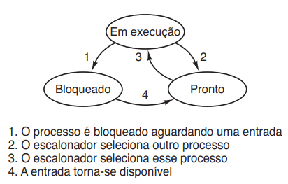
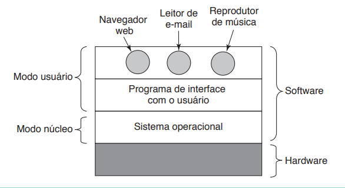

# Resumo sobre processos em SO.

## Proteção de Hardware (Modo Dual)

---

Um processo é apenas uma instância de um programa em execução, incluindo os valores atuais do contrador do programa (PC), registradores e variáveis. Conceitualmente, **cada processo tem sua própria CPU virtual**. Porém, na verdade a CPU real troca a todo momento de processo em processo, mas para compreender melhbor é mais fácil pensar a respeito de uma coleção de processos sendo executados em **pseudoparalelismo**, do que pensar que a CPU troca de um programa para outro. Esse mecanismo é chamado de **multiprogramação**.

Dizemos que uma CPU **executa apenas um programa (processo) por vez**, ou seja se temos uma CPU multicore (ou CPUs), cada uma delas irá executar apenas um processo por vez.

A diferença entre um processo e um programa é sutíl, porém fundamental: Um processo possuí:

- Um código (descrito pelo programa)
- Um estado (que mostra seu estado de execução pela CPU)
- Dados de entrada (input)

---
### Criação de processos

Quatro eventos principais estão descritos para a criação de processos:

1. Inicialização do sistema.
2. Execução de uma chamada de sistema de criação de processo por um processo em execução
3. Solicitação do usuário para criar um novo processo
4. Início de uma tarefa em lote.

Quando o sistema operacional é iniciado, uma séria de processos são criados. Em geral, são deixados processos em primeiro plano (que irão interagir diretamente com o usuário na maioria das vezes) ou processos em segundo plano, que estão ali para alguma função. Esses processos em segundo plano são chamado de **daemons**.

---
### Estados de processos

Geralmente um processo tem 3 estados:

1. Em execução (realmente utiliza a CPU naquele instante)
2. Pronto (executável, temporariamente parado para deixar outro processo ser executado)
3. Bloqueado (incapaz de ser executado até que algum evento externo aconteça). 

.

Geralmente quem gerencia esses processos é uma camada "oculta" que cuida de todo o tratamento de interrupções e detalhes sobre o início e parada de processos, essa camada é chamada de **escalonador**.

---

Compartilhamento de recursos requer que o S. O. garanta que um programa não prejudique a execução dos demais. 

.

Um bit acrescentado ao hardware permite diferenciar dois modos de operação:

1. Modo usuário - a favor do usuário

2. Modo monitor (Modo supervisor ou Modo Sistema/Núcleo) - a favor do S. O.

Esse bit é chamado de **Bit de Modo**, indicando o modo corrente: 

`monitor (0) / usuário (1)`

Quando uma interrupção acontece (ou exceção) o hardware muda para o modo monitor **Bit de Modo = 0**

No **modo supervisor** o computador possui acesso total as instruções de máquina, podendo executar qualquer uma delas. No **modo usuário** apenas algunas instruções tornam-se disponíveis. Em particular, instruções que afetam o controle da máquina ou realizam E/S (Entrada/Saída) são proibidas para programas de modo usuário. 

Uma distinção importante entre o sistema operacional e o software normal (modo usuário) é que se o usuário não gostam de um leitor de e-mail, ele é livre para escolher outro ou escrever o seu próprio. Porém o usuário não é livre para escrever seu próprio tratador de interrupção de relógio, o qual faz parte do sistema operacional e é protegido por hardware contra tentativas dos usuário de modificá-lo.

---
### Permissões

.