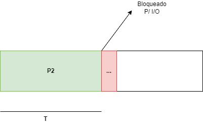

# Lista 01 de Sistemas Operacionais
## Bernardo Ferreira Temponi
## Danniel Henrique Correa Vieira
## Diego Basílio Arruda
## Diogo Araujo Miranda
## Matheus Lage da Costa
### Ciência da Computação - PUC Minas

---

1. Quais das seguintes instruções devem ser permitidas apenas em modo supervidor?

- Desabilitar todas as interrupções 

Deve ser permitida apenas em modo supervisor - dependendo de alguns casos. Algumas interrupções não devem ser desabilitadas a fim de não comprometer os outros processos que podem estar em estado de pronto ou bloqueado. Por exemplo, se ocorrer uma interrupção por falha de disco, e o usuário conseguir desabilitar esse tipo de interrupção, o processo não será registrado no vetor de interrupções e consequentemente não será possível ser manipulado pelo tratador de processos.

- Ler relógio da máquina

Pode ser mantida tanto em modo supervidor quanto em modo usuário, já que é uma operação de leitura e não manipulação.

- Alterar o relógio da máquina

Deve ser permitida apenas em modo supervidor, pois é uma operação de mudança no estado de um hardware do computador. Essa mudança deve ser protegida em nível de hardware para não comprometer seu funcionamento por um usuário

- Mudar o mapa de memória

Deve ser permitida apenas em modo supervidor, já que se mudarmos o range de memória (ou o mapa) da alocação de processos, consequentemente iremos perder a referência do ponteiro e do contador de programa dos processos.

2. Um arquivo cujo dono tem uid = 12 e gid = 1 tem modos de permissão rwxr-x---. Outro usuário com  uid = 6 e gid = 1 tenta acessar o arquivo. O que irá acontecer? 

O arquivo possúi permissões **rwxr-x---**

Isso quer dizer que, o dono possui permissões totais sobre o arquivo (leitura, escrita e execução). Já o grupo possuí permissões de leitura e execução. O usuário de uid=12 está no grupo de gid=1. E o usuário de uid=6 está no grupo de gid=1. Sendo assim, o usuário de uid=6 irá conseguir **ler e executar o arquivo**, mas **não conseguirá escrever no mesmo**.

3. O que é SIGALARM? Como podemos enviá-lo a um processo? Tem sentido ignorar SIGALARM? 

É um sinal pertencente a família de sinais que servem de comunicação entre processos, que funcionam, como interrupções de processos. Essa família de sinais possui um handler, que é uma função executada quando um sinal é recebido por um processo. Esses finais são utilizados para tratamentos de exceções e de acontecimentos assíncronos.

O SIGALRM é enviado pelo serviço alarm() que pode ser implementado na linguagem C, que envia um sinal após a passagem de X seconds. Esse sinal pode ser recebido por uma handler function, que dará um tratamento necessário após essa passagem. 

Não é interessante ignorar, já que podemos dar um tratamento específico a um processo após a passagem de alguns segundos, como o pause() do processo ou exit() (return, no caso da linguagem C).

4. Suponha que você projete um computador com chaveamento de processo feito por hardware ao invés de o efetuar por interrupções. Quais informações são necessárias? Como seria este processo por hardware? 

- Todas interrupções começam salvando os registradores, muitas vezes na entrada da tabela de processo para o processo atual. 

- Essa informação empurrada para a pilha pela interrupção é removida e o ponteiro de pilha é configurado para apontar para uma pilha temporária usado pelo **tratador de processos**. 

- Quando a rotina é concluída, chama-se uma rotina com um handler em linguagem de alto nível para fazer o resto do trabalho. 

- Quando o processo estiver **pronto** o escalonador é chamado para ver qual o próximo processo a ser executado. Depois disso, o controle é passado de volta ao código de linguagem de montagem para carregar os registradores e mapa de memória para o processo agora atual e iniciar sua execução. 

Para executar um chaveamento por hardware, precisaremos de informações relacionados a: **registradores do processo, contador de programa para saber qual o próximo programa a ser executado, e status do processo**

Funcionaria da seguinte maneira:

- Iremos chavear por meio de um bit esse processo (bit 1) e coloca-lo em uma fila de chaveamento.
- O hardware irá empilhar o contador de programa. 
- Será salvo na fila de chaveamento os registradores.
- Um serviço de handler em linguagem de alto nível irá executar o serviço de tratamento para processos chaveados.
- O escalonador irá decidir qual o processo processo.
- O processo de alto nível irá dar um código de retorno, e será chaveado agora como o (bit 0). 
- Irá iniciar um novo processo atual.

5. Em um sistema com threads, existe uma pilha para cada thread ou uma pilha por processo? Justifique sua resposta. 

Existe uma pilha para cada thread. Um thread será executada como um "subprocesso" e terá informações atreladas a ela, e poderá gerar novas threads.

6. O CDC 6600 podia trabalhar com até 10 processos usando uma forma especial de escalonamento round-robin denominada compartilhamento de processador. Um chaveamento ocorria após cada  execução de uma instrução. A 1ª instrução do processo p1, a 1ª instrução do processo p2 e assim sucessivamente. Suponha overhead próximo de zero. Se um processo necessita de T segundos para completar sua operação (sem concorrência),  quanto tempo gastará se o processador for compartilhado com n processos? 

Iriam necessitar de n*T segundos

7. Escalonamento roud-robin mantém uma lista de processos executáveis, com cada processo aparecendo apenas uma única vez na lista. O que aconteceria se um processo aparecesse mais de uma vez? Por que motivo poderíamos permitir tal fato? 

Acontece quando temos múltiplos quantum por ciclos para esse processo. Isto pode ser utilizado para dar maior compartilhamento de CPU para processos de maior importância.

8. Medida de um certo sistema mostraram que um processo roda, em média,  por um período T  antes de ser bloqueado em uma operação de I/O. Considere que a troca de contexto consuma um tempo S (overhead). Qual é a fórmula que descreve a eficiência da CPU,  para um escalonamento round-robin com quantum Q, supondo: 

.

- Q = infinito

Já que o quantum é infinito, T será menor que infinito. Portanto irá conseguir executar em 1 rodada do roudin-robin. 

Eficiência CPU: T/S+T 

- Q > T

Teremos ainda um quantum maior que T, possibilitando o processo executar em 1 rodada do roudin-robin. 

Eficiência: T/S+T

- S < Q < T 

Teremos T < Quantum, ou seja, teremos + do que 1 rodada para executar o processo. Teremos um overhead, por sua vez, menor do que o quantum. 

Eficiência: (T/ (ST/Q) ) * (Q+S) = Q/Q+S 

- Q = S

Quanto maior o quantum, maior o overhead. Supondo que (Q = S) < T, teremos, eficiência:

Q/Q+Q = 0.5 = 50%

- Q próximo de 0

Teremos um grande overhead, já que iremos executar várias rodadas do roudin-robin.

lim q -> 0 (Q/Q+S) = 0

9. Cinco tarefas são disparadas ao mesmo tempo. Seus tempos estimados de execução são de 10, 6, 2, 4 e 8 minutos. Considere que suas prioridades são 3, 5, 2, 1, e 4, respectivamente (1 a maior prioridade). Para cada um dos algoritmos abaixo, determine o turnaround médio. Ignore o tempo gasto na troca de contexto. 

- Round-Robin

**Tempo de Espera**
P1=0+(3+2+3+3)+(3+1+3)+(2)=20 
P2=3+(2+3+3)=11
P3=6
P4=8+(3+3+3)=17
P5=11+(3+3+1)+(3)=21

Tmedio = 15

**Tempo de Resposta**

P1=0
P2=3
P3=6
P4=8
P5=11

Tmedio = 5.6

**Tempo de Retorno**

P1=1+2+3+3+1+3+3+3+3+2+3+3=30
P2=3+3+3+3+2+3+3=20
P3=2+3+3=8
P4=1+3+3+3+3+2+3+3=21
P5=2+3+3+1+3+3+3+3+2+3+3=29

Tmedio = 21.6

- Escalonamento por prioridade

**Tempo de Espera**
P1=14
P2=24
P3=4
P4=0
P5=6

Tmedio = 9.6

**Tempo de Resposta**

P1=14
P2=24
P3=4
P4=0
P5=6

Tmedio = 9.6

**Tempo de Retorno**

P1=24-14=10
P2=30-24=6
P3=6-4=2
P4=4-0=4
P5=14-6=8

Tmedio = 6

- FCFS (10,6,2,4,8) 

**Tempo de Espera**
P1=0
P2=10
P3=16
P4=18
P5=22

Tmedio = 13.2

**Tempo de Resposta**

P1=0
P2=10
P3=16
P4=18
P5=22

Tmedio = 13.2

**Tempo de Retorno**

P1=10
P2=6
P3=2
P4=4
P5=8

Tmedio = 6

- SJF

Tr = 25

1.  Um sistema de tempo real tem 4 eventos com períodos de 50, 100, 200, 250 msegs cada. Considere que cada evento demande 35, 20, 10 e x msegs de CPU respectivamente. Qual o maior valor de x para que o sistema continue escalonável?  

35/50 = 0.7
20/100 = 0.2
10/200 = 0.05
x/250 = ?

0.7 + 0.2 + 0.05 + x/250 < 1
x/250 < 1 - 0.95
x <= 0.05 * 250 = 12.5